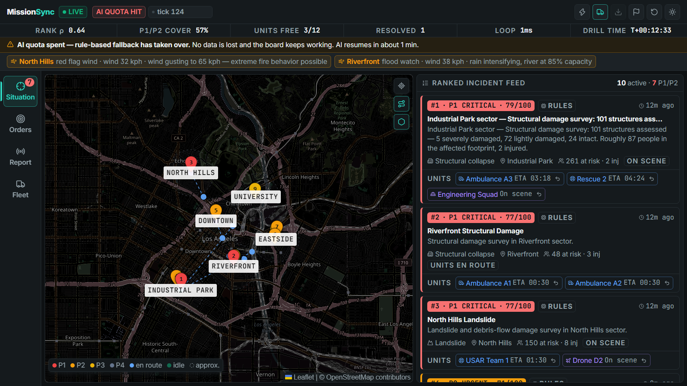
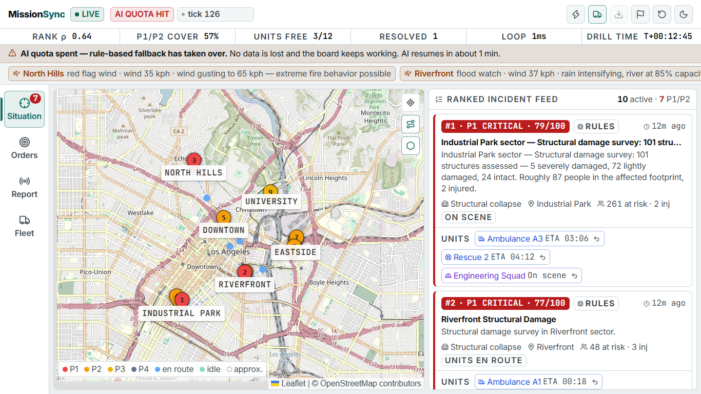
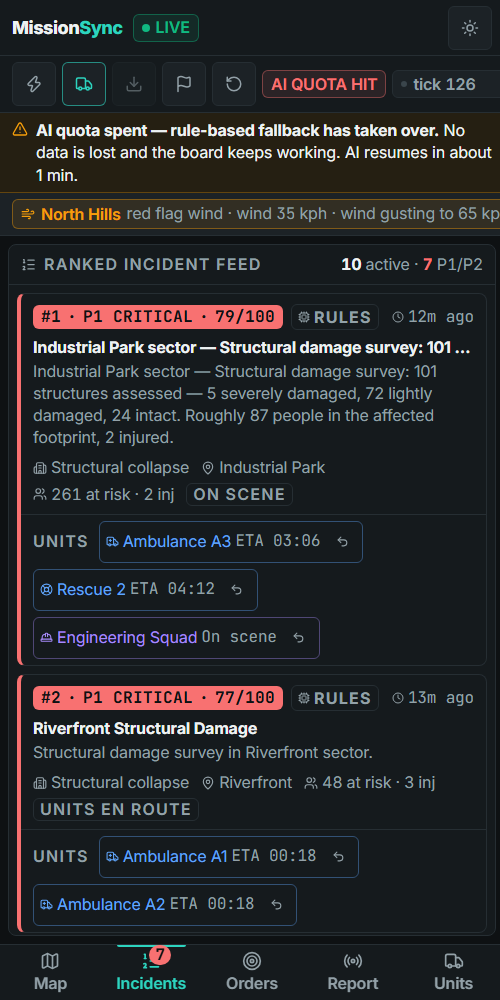
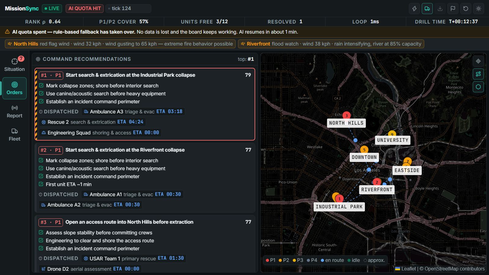
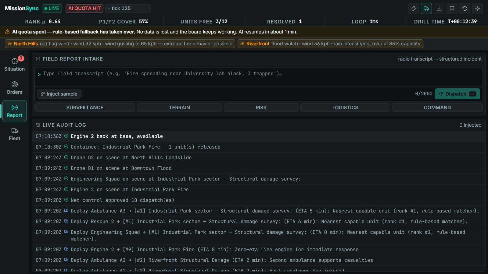
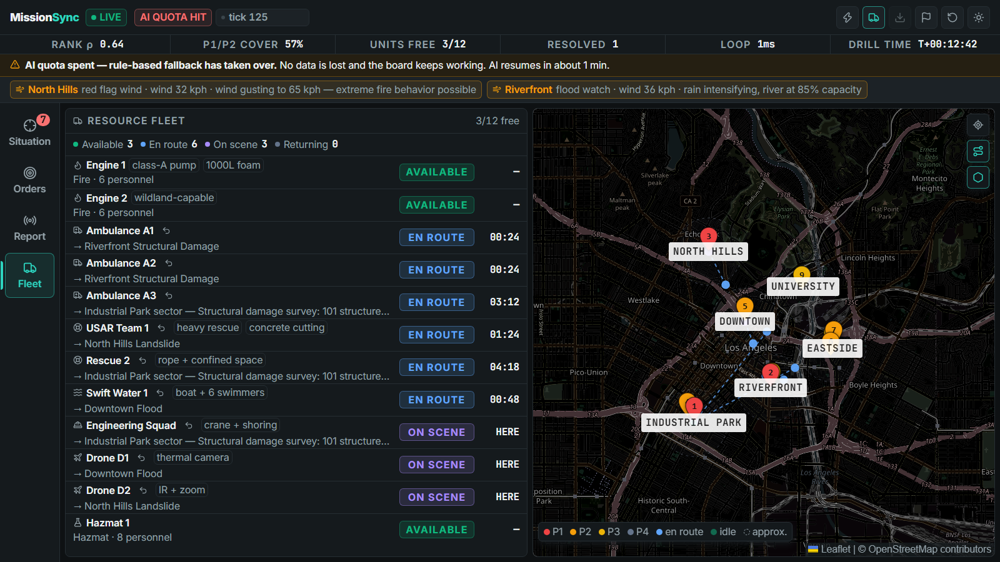

# MissionSync

> One live, ranked operational picture for volunteer emergency-response drills — built for the net control lead who is currently juggling a radio, a notebook, and a whiteboard.

[](https://missionsync-web.onrender.com)
[](https://github.com/sahinurrahman-debug/MissionSync)


---

## Preview

**Tactical Night** (default) on a 1600×900 tactical monitor:



| Day mode (1366×768 field laptop) | Phone (bottom-tab layout) |
|---|---|
|  |  |

**One section per panel.** A left navigation rail (keys `1`–`4`) splits the dashboard so nothing competes for space — *Situation* (map + ranked incidents), *Orders* (approve / reject dispatches beside the map), *Report* (intake + live audit log), *Fleet* (every unit beside the map). Phones get the same sections as a bottom tab bar.

| Orders | Report | Fleet |
|---|---|---|
|  |  |  |

---|---|
|  |  |

---

## What It Does

During a 3-hour drill, the net control lead of a campus CERT or amateur-radio team transcribes every radio call onto a paper log and decides in their head which incident matters most. MissionSync turns typed field reports into a structured, ranked operational picture: reports are parsed into incidents, duplicates are merged into one entry, every incident is scored on a transparent 0–100 urgency scale (four auditable components → P1–P4 tier), and available units are matched to incidents with capability-aware deployments and ETAs. It updates live — units drive to their assignments, work the scene, contain it, and return to base; unaddressed casualties get worse; the ranking re-orders itself as the drill evolves. A judge can open the site, type a mid-drill report, and watch the board re-rank.

---

## Two ways it runs

| | **Full stack** (the real thing) | **Demo engine** (static hosting) |
|---|---|---|
| Agents | 5 LLM agents on **Groq** (`gpt-oss`), JSON mode, validated by code | Rule-based twins of the same agents, in the browser |
| Scenarios | **Real xBD satellite damage surveys** (Kaggle), scored against hidden ground truth | 9 hand-authored, internally consistent incidents |
| Push | FastAPI + WebSocket, every pipeline stage streamed | In-process |
| Header badge | `AI · openai/gpt-oss-20b` | `DEMO ENGINE` (plus a banner) |

The app is honest about which one you're looking at. The header badge says **AI** (LLM running), **RULES · LLM off** (no key or provider failing), **AI QUOTA HIT** (Groq daily token quota spent — rule-based agents cover and a banner says when AI resumes), or **DEMO ENGINE**. Each incident card also carries a provenance tag (`AI` / `rules`).

---

## Features

- **Sectioned navigation** — a side rail (desktop) / bottom tabs (phone) gives each job its own panel, with live badges for P1/P2 incidents and dispatches awaiting approval; `1`–`4` switch sections and the last one is remembered.
- **Ranked incident feed** — transparent 0–100 urgency (severity / population / spread / time-criticality, weighted composite computed in plain code); click a card for the component breakdown and rationale.
- **Live incident map** — priority-colored markers sized by urgency (P1/P2 pulse), every responder unit drawn (idle at base, en route, on scene, returning). A dashed ring marks a report that named no place.
- **Free-text report intake** — type what is happening and where. The place words ("University lab block", "Industrial Park gate 3", "Riverfront levee") put it on the map; the same type within ~1.5 km merges into the existing incident; text that isn't an emergency is rejected instead of dispatching a unit.
- **Agents propose, you decide** — the recommendation panel lists proposed dispatches (unit → incident, ETA, reason). Nothing moves until net control approves one, approves all, or rejects it (a rejected pairing doesn't come back). You can also dispatch any capable, available unit yourself, recall a unit, mark an incident contained, or close it. A header toggle switches to *auto-dispatch* for unattended demos.
- **Instant, then refined** — a new report is ranked in well under a second by the rule-based twin and marked *AI scoring…*; the LLM refines the score in the background and the card updates in place.
- **Command recommendations** — imperative headline orders, action bullets, weather-aware warnings for the top four incidents, with the units *actually deployed* and their ETAs.
- **Incident lifecycle** — en route → on scene → worked → contained → units return to base and become available again. New waves keep arriving, so a drill never runs dry. **Restart** starts over; **End** freezes the drill and unlocks the after-action CSV.
- **Resource board & event log** — all 12 units with status/assignment/ETA, plus a timestamped audit trail of every parse → merge → rank → deploy step.
- **After-action record** — with a database attached, every drill's audit trail and submitted reports are stored; ⬇ in the header downloads the CSV (`/api/drills/{id}/export.csv`).
- **Two engineered themes** (Tactical Night / high-contrast Day), skeletons sized to the real components, a radar empty state, an offline banner, and per-panel error boundaries — the board never blanks or shows a raw error.

---

## Tech Stack

| Technology | Purpose |
|---|---|
| React 18 + TypeScript + Vite | Dashboard |
| Tailwind CSS 3 | Design tokens as CSS variables → two themes, no per-theme class names |
| Lucide icons, Framer Motion | Icon set; layout animation when incidents re-rank |
| Leaflet + react-leaflet | Incident map on OpenStreetMap tiles (no API key), custom SVG pins |
| FastAPI + uvicorn + WebSocket | Backend, live push |
| Groq (`openai/gpt-oss-20b`, falling back to `-120b`) | LLM for the five agents |
| Pydantic | Typed models, and the validation gate for LLM output |
| kagglehub + xBD | Real scenario data |
| PostgreSQL (SQLAlchemy) | Optional: drill history, audit trail, submitted reports, CSV export |
| Vitest + Testing Library + axe-core, pytest | 106 frontend + 124 backend tests, an automated accessibility check, and a WCAG contrast audit |

---

## Design system

Full spec: [`docs/DESIGN_SYSTEM.md`](./docs/DESIGN_SYSTEM.md). Direction: *Tactical ops center meets Linear/Vercel* — utilitarian, high-contrast, calm under pressure, dense. The palette and component language were explored in Canva first ([design-system board](https://www.canva.com/d/dZFerA8Z6QapTVw)) and then implemented as tokens in [`frontend/src/index.css`](./frontend/src/index.css).

| Token | Tactical Night | Day | Used for |
|---|---|---|---|
| Surface / panel / raised | `#0E1113` / `#151A1D` / `#1C2226` | `#ECF0F1` / `#FFFFFF` / `#F3F6F7` | page, cards, hover |
| Text / secondary | `#EEF2F3` / `#93A1A8` | `#0E1417` / `#3F4C53` | body, telemetry |
| Accent | `#2DD4BF` teal | `#0D6862` deep teal | focus, primary action, links |
| Urgency P1 → P4 | `#EF4444` · `#F59E0B` · `#EAB308` · `#64748B` | darker equivalents | fixed across themes — they carry life-safety meaning |
| Unit status | `#10B981` available · `#60A5FA` en route · `#A78BFA` on scene · `#64748B` returning | darker equivalents | fleet board, map |

- **Type scale:** Inter for UI, JetBrains Mono (tabular numerals) for metrics, timers and logs. **Every piece of text in the UI is ≥ 16 px** — titles, descriptions, chips, labels, map labels and tab captions (Tailwind's `xs`/`sm` are remapped to 1 rem, and a regression test guards it). Hierarchy comes from weight, colour, case and tracking rather than smaller type; density comes from layout. Verified by a computed-style audit of every text node at 375, 768, 1024, 1280, 1600 and 1920 px.
- **Colour is never the only signal:** every urgency shows tier text *and* a numeric score (`#1 · P1 CRITICAL · 94/100`); every unit status is a labelled chip.
- **Contrast:** `npm run audit:contrast` checks all 48 text/background pairs in both themes against WCAG 4.5:1 — 0 failures.
- **Layout:** full-viewport, zero body scroll. 55/45 command grid on ≥ 1024 px (map + ranked feed | orders + intake + fleet/log tabs); on tablets and phones a thumb-reachable bottom tab bar (Map · Incidents · Orders · Report · Units) with a P1/P2 badge. Verified at 375, 768, 1366 and 1920 px with no horizontal overflow.
- **Motion (purposeful only):** pulsing rings on P1/P2 pins, spring layout animation when the ranking changes, a glowing active stage in the five-step pipeline stepper, animated score bars. All of it honours `prefers-reduced-motion`.

---

## Level 1 alignment & scope drift

Kenshi is judged on the frontend, so the core loop (report → merge → re-rank → recommend) runs fully in the browser via the demo engine, as the Roadmap's Milestone 1 committed. Deviations from the Level 1 plan, stated plainly:

1. **Scope added beyond Kenshi:** a real FastAPI backend with LLM agents, real xBD data, WebSocket push, and optional Postgres (Roadmap Milestone 2 material). It is optional — the deployed frontend works on its own — but it is in the repo and wired.
2. **Pulled forward from Samurai:** human confirm/override of assignments (the PRD's FR-7/FR-8 rule — the default), restoring the live drill after a restart (from Postgres), and a shared admin key for the destructive controls. **Still deferred:** real auth and roles, multi-tenant isolation.
3. **Changed from the Level 1 sketch:** the xBD Kaggle pull is real in the full stack (the Roadmap deferred it to Samurai); the demo engine uses a hand-authored scenario with damage grades on the same 0→10 … 3→90 scale.
4. **Urgency tiers** stay as the Level 1 docs define them (P1 ≥ 75, P2 ≥ 55, P3 ≥ 35, else P4), so the ranking you see matches the documented methodology.

---

## Run locally (full stack)

You need Python 3.11+ and Node 18+.

```bash
# 1. Backend  (terminal 1)
cd backend
python -m venv .venv
.venv/Scripts/python -m pip install -r requirements.txt     # macOS/Linux: .venv/bin/python
cp .env.example .env                                         # then fill in GROQ_API_KEY (+ KAGGLE_API_TOKEN, optional)
.venv/Scripts/python -m uvicorn missionsync.main:app --port 8000

# 2. Frontend (terminal 2)
cd frontend
npm install
npm run dev                                                  # http://localhost:5173
```

`npm run dev` proxies `/api` and `/ws` to the backend on `:8000`, so there is nothing else to configure. Open http://localhost:5173 — the header should read `LIVE` and `AI · openai/gpt-oss-20b`.

**Try the core loop:** type *"fire spreading near the University lab block, three students trapped"* and inject it. It parses, lands on the University sector, is ranked immediately (*AI scoring…*), and the agents propose units — review them in **Command recommendations** and press **Approve**. Watch the pipeline chip step through the five agents.

**No backend?** Just run `npm run dev` on its own: the app detects there is no server and runs the in-browser demo engine, badged `DEMO ENGINE`. (`?engine=local` forces it.)

### Environment variables

| Variable | Where | Description |
|---|---|---|
| `GROQ_API_KEY` | backend | Groq key. Without it the agents run rule-based (badge: `RULES · LLM off`). |
| `GROQ_MODEL` / `GROQ_FALLBACK_MODEL` | backend | Optional. Defaults `openai/gpt-oss-20b` / `openai/gpt-oss-120b`. When one model's daily quota is spent the other is used automatically. |
| `KAGGLE_API_TOKEN` | backend | Optional. Downloads real xBD labels live. Without it the bundled snapshot of the same real records is used. |
| `XBD_SOURCE` | backend | `snapshot` (default, bundled real records) or `kaggle` (live download). |
| `XBD_FILE_PATH` | backend | Optional. Load one specific file from the Kaggle dataset instead (implies `kaggle`). |
| `ADMIN_KEY` | backend | Protects Restart / End / dispatch-mode (`X-Admin-Key`). Empty = open (local dev). Render generates one; the dashboard asks for it once per tab. |
| `AUTO_DISPATCH` | backend | `false` (default): humans approve dispatches. `true`: commit recommendations immediately. |
| `LOG_FORMAT` / `LOG_LEVEL` | backend | `json` or `text`; one line per request with a request id. |
| `MAX_WS_CLIENTS` | backend | Concurrent dashboards (default 200); more get close code 1013. |
| `SENTRY_DSN` | backend | Optional error tracking (`pip install sentry-sdk`). |
| `VITE_TILE_URL` / `VITE_TILE_ATTRIBUTION` | frontend | Map tile provider (default OpenStreetMap — fine for demos, use a provider for real traffic). |
| `DATABASE_URL` | backend | Optional Postgres URL (Render injects it). Enables drill history + CSV export; without it everything runs in memory. |
| `CORS_ORIGINS` | backend | Comma-separated allowed origins. Defaults to the local dev origins; **set it to your frontend URL in production.** |
| `VITE_API_URL` | frontend | Backend base URL for production builds. Empty in dev. |
| `BACKEND_URL` | frontend dev | Where the dev proxy points (default `http://127.0.0.1:8000`). |

### Groq free-tier quota — read this

The free tier allows roughly **200,000 tokens per day per model, per organization** (a second key in the same org shares the budget). MissionSync is built for that budget: terrain/risk results are cached by report *content* (and persisted to Postgres, so a restart doesn't re-spend tokens), logistics is consulted only when an incident needs units, command is re-drafted only when the picture changes, and idle ticks cost **zero** calls. If both models are spent the badge turns to `AI QUOTA HIT`, a banner says when it resumes, and the rule-based twins keep the board running. For live demos on the free tier, restart the drill sparingly, or upgrade to Groq's Dev tier.

### Measured

| What | Result | How |
|---|---|---|
| Ranking accuracy vs hidden xBD ground truth | Spearman ρ = **0.90** (live LLM) | `scripts/measure_live.py` |
| Report → ranked on the board | **~70 ms** p50 with one dashboard open (rule-ranked, then LLM-refined in the background) | `scripts/load_test.py` |
| Fan-out cost | Intake stays fast for a demo-sized audience: p50 ≈ 70 ms (1 dashboard), ≈ 250 ms (10), ≈ 0.8 s (50, measured on one shared laptop CPU that also ran the load generator). All 50 sockets held, 0 drops, 0 failed reports. A stuck client is dropped after 5 s and never blocks the drill | `scripts/load_test.py --clients N` |
| Contrast | every token pair ≥ WCAG AA in both themes (incl. tinted status chips) | `npm run audit:contrast` |
| Lighthouse, desktop | Performance **95–97** · Accessibility **96** · Best practices **100** · SEO **100**; FCP 0.5 s, LCP 1.3–1.5 s, TBT ≈ 0 ms, CLS 0.025 | Lighthouse 13, production build via `vite preview`, Edge headless |
| Lighthouse, mobile (simulated slow 4G + 4× CPU) | Performance **84–85** · Accessibility **100** · Best practices **100** · SEO **100**; FCP 2.3 s, LCP 3.2 s, TBT ≈ 240 ms, CLS 0.07 | same |
| Frame pacing while using the board (section switches, approving, scrolling, selecting) | **55 fps** average, p95 frame 17.2 ms, 98 % of frames faster than 30 fps; the slow frames are section switches that remount the map. Software-rendered headless Edge, so a real GPU is faster | `node scripts/measure_fps.mjs` |

The one remaining Lighthouse accessibility note on desktop is Leaflet's overlapping map pins (target-size); the incident feed offers the same selection with large targets.

### Tests

```bash
cd backend  && .venv/Scripts/python -m pip install -r requirements-dev.txt && .venv/Scripts/python -m pytest
cd frontend && npm test && npm run typecheck && npm run audit:contrast
```

CI ([`.github/workflows/ci.yml`](./.github/workflows/ci.yml)) runs all of it on every push. The frontend suite includes component tests (Testing Library), keyboard/ARIA behaviour, an axe-core accessibility scan, and a mock-WebSocket test of reconnect/backoff. Backend tests never touch the network. A fake Groq client proves the whole pipeline runs in **pure LLM mode with zero rule-based fallbacks**, that bad LLM output (invalid types, unavailable or incapable units, out-of-range scores) never reaches world state, and that quota exhaustion degrades visibly.

---

## The data

Scenarios are **real xBD** building-damage annotations (`rayanhossain239/damageactu-xbd-full`, Gupta et al. 2019, CC BY-NC-SA 4.0) — 20 label files spanning volcano, flood, hurricane-wind and wildfire events. Each file becomes one incident:

- The agents read an **observable scene report** built from the per-building counts (*"Floodwater damage survey: 110 structures assessed — 74 severely damaged, 36 lightly damaged. Roughly 258 people in the affected footprint, 37 injured."*). Grade labels are never in the text.
- The **hidden ground truth** is the mean Joint Damage Scale urgency over the file's classified buildings (no-damage 10, minor 40, major 70, destroyed 90), used only to compute the Spearman ρ shown in the header. Typed reports have no ground truth, so they can never move it.
- xBD is mostly "no damage"; the sampler deals across hazard types and keeps at most four quiet scenes. `scripts/build_xbd_snapshot.py` rebuilds the bundled real-data snapshot (`backend/missionsync/data/xbd_seeds.json`) from Kaggle.

Load order: live Kaggle → bundled real snapshot → synthetic cohort (last resort, header notes it).

---

## Deploy on Render (database + API + frontend)

The repo ships a Blueprint, [`render.yaml`](./render.yaml), that creates all three pieces:

| Render service | What | Notes |
|---|---|---|
| `missionsync-db` | Postgres | Audit trail, reports, drill history. Free plan expires after 30 days. |
| `missionsync-api` | Python web service (`backend/`) | `uvicorn missionsync.main:app`, health check `/api/health`, WebSocket included. Free plan sleeps when idle (~1 min cold start). |
| `missionsync-web` | Static site (`frontend/`) | `npm ci && npm run build` → `dist`. |

1. Push the repo to GitHub (it already is: `sahinurrahman-debug/MissionSync`).
2. Render dashboard → **New → Blueprint** → select the repo → **Apply**.
3. When prompted, set the secrets: `GROQ_API_KEY` (and optionally `KAGGLE_API_TOKEN`). Leave `CORS_ORIGINS` and `VITE_API_URL` for now (put any placeholder, e.g. `https://x.onrender.com`). `ADMIN_KEY` is generated for you — read it under the API service's **Environment** tab when you need to restart or end a drill.
4. Wait for the first deploy, then copy the two public URLs from the dashboard (e.g. `https://missionsync-api.onrender.com` and `https://missionsync-web.onrender.com`).
5. Set **`CORS_ORIGINS`** on `missionsync-api` = the *frontend* URL, and **`VITE_API_URL`** on `missionsync-web` = the *API* URL (no trailing slash). Then **Manual Deploy → Clear build cache & deploy** the frontend (Vite bakes `VITE_API_URL` in at build time) and redeploy the API.
6. Open the frontend URL. The header should read `LIVE` and `AI · openai/gpt-oss-20b`; `GET <api-url>/api/health` should show `"database": "postgresql"`.

State note: one instance runs one shared drill. With a database attached the drill is checkpointed and **restored after a restart or a free-tier wake-up**; without one it starts fresh. The API start command trusts Render's proxy headers (`--forwarded-allow-ips='*'`) so each visitor gets their own rate-limit bucket. Free-tier limits to know: the API sleeps after ~15 min idle (first request takes ~1 min) and the free Postgres is deleted after 30 days.

## Licence

Code: [MIT](./LICENSE). Data and assets: see [`NOTICE`](./NOTICE): the xBD data is **CC BY-NC-SA 4.0 (non-commercial)**, map tiles © OpenStreetMap contributors, fonts are bundled (SIL OFL) and served from this site.

## Planning Docs

- [PRD](./docs/PRD.md) · [Architecture](./docs/ARCHITECTURE.md) · [Requirements](./docs/REQUIREMENTS.md) · [API spec](./docs/API_SPEC.md) · [Roadmap](./docs/ROADMAP.md) · [Design system](./docs/DESIGN_SYSTEM.md)
- [Sketch](./docs/SKETCH.md) — live board: <https://excalidraw.com/#room=dc45f75888800794e0e6,kvfdLtfMVJnRXNi0TIiYJw> · static backup [`docs/sketch.png`](./docs/sketch.png)
- [Legacy prototype notes](./docs/LEGACY_MISSIONSYNC_NOTES.md)

**Scope notes.** Implemented: report intake, parse → merge → risk → logistics → command pipeline, live push, incident lifecycle, error envelope + rate limit, drill restart, audit endpoint. Postgres history + CSV export are in (optional). Also in: human approval of dispatches, manual dispatch/recall/close, end-drill, drill restore after restart, idempotent report submits, an admin key for destructive controls, WebSocket origin check and connection cap, structured JSON logs. **Not yet (Samurai/Shogun):** per-user auth and roles, multi-tenant isolation. Until then the backend serves a single shared drill; `/api/report` is open (rate-limited per client and length-capped) and restart/end need the admin key.

---

## What I Learned

The hardest part was keeping "agents propose, code decides" true under a real LLM: every model output is validated and clamped before it can touch state — invented incident types are dropped, scores are clamped to 0–100, and an assignment must name an available, capable unit inside the crew cap, with a deterministic guard that no P1/P2 is left uncovered. The second lesson was that a free-tier token budget is an architectural constraint, not a footnote: caching by *material* change (not by time) took idle ticks from ~12 model calls each to none. The third was honesty in the UI — a badge that says which engine is running, a banner when the quota is spent, and a metric (ρ against real xBD ground truth) that typed reports cannot inflate.

---

*Submitted to Journey to Mastery — Level 2: Kenshi (frontend) on the Level 1 backend*
