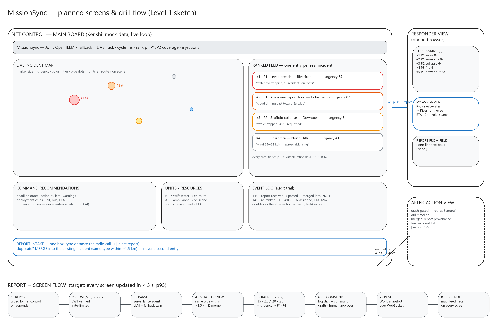

# MissionSync

> Small volunteer emergency-response teams run drills on paper logs and group chats; MissionSync gives them one live, ranked operational picture instead.

---

## The Idea

Campus CERT clubs and amateur-radio emergency teams run their exercises the same way professionals run real incidents — reports, triage, unit assignments — but with a notebook and a whiteboard, so duplicate reports become duplicate entries and the genuinely urgent call waits behind the roll call. MissionSync turns typed field reports into a structured, ranked, live operational picture: incidents are parsed, merged when they're duplicates, scored on transparent 0–100 urgency components, and matched to available units with capability-aware recommendations that a human approves. Net control gets one screen to run the drill from; responders and the exercise director see the same picture from their own devices. The bet worth testing is that volunteer teams don't need CAD-system infrastructure to get professional-grade triage — they need the paper log they already keep, made live and shared.

---

## Sketch



[View live board (Excalidraw)](https://excalidraw.com/#room=dc45f75888800794e0e6,kvfdLtfMVJnRXNi0TIiYJw) — opens in the browser, no login or access request.

*Scene source: [docs/sketch.excalidraw](./docs/sketch.excalidraw) — regenerates the board at any time. Publishing and export steps: [docs/SKETCH.md](./docs/SKETCH.md).*

---

## Documents

- [Product Requirements](./docs/PRD.md)
- [Architecture](./docs/ARCHITECTURE.md)
- [API Spec](./docs/API_SPEC.md)
- [Roadmap](./docs/ROADMAP.md)
- [Requirements](./docs/REQUIREMENTS.md)
- [Sketch notes & publishing steps](./docs/SKETCH.md)

---

## Planned Stack

| Layer | Technology | Why |
|---|---|---|
| Framework | React 18 + TypeScript + Vite (frontend) · FastAPI + uvicorn (backend) | Both already proven in this repo's prototype; WebSocket push onto a React re-render is exactly what a live drill board needs. |
| Mapping | Leaflet + react-leaflet | Free OpenStreetMap tiles with no API key to manage, and the drill map is markers on a city — a paid map platform buys nothing here. |
| Database | PostgreSQL (via SQLAlchemy 2.0 async) | Org → drill → incident → assignment state is relational, and JSONB absorbs the free-form fields LLM parsing produces. |
| Auth | Firebase Authentication (email/password + Google) | Managed email verification, reset, and refresh tokens for free; org roles stay in Postgres keyed by Firebase UID. |
| Hosting | Railway (API + Postgres) · Netlify/Vercel (frontend) | Cheapest path to HTTPS, managed Postgres, and git-push deploys at the free tiers that suffice for 25 users. |
| Realtime | Single WebSocket pushing full world snapshots | Every drill screen must show the same picture within seconds; snapshot-on-cycle is simple and debuggable at ≤ 50 viewers. |
| Intelligence | Groq (JSON-mode) + deterministic fallback twins | Sub-second structured completions fit the cycle budget; rule-based twins mean an LLM outage can never stall a drill. |
| Scenario dataset | xBD damage assessment (`rayanhossain239/damageactu-xbd-full`) via kagglehub | Real building-damage records seed the simulator; ordinal damage grades convert to hidden ground-truth urgency for honest ranking metrics, with an offline fallback cohort when Kaggle is unreachable. |

---

## What I'm Building Toward

**Kenshi (frontend).** The full three-pane drill board — live map, ranked incident feed with auditable rationales, command recommendation cards, units panel, event log, and the one-box report intake — deployed as a static site with a mock state layer that streams simulated radio traffic and accepts typed reports, so the report → merge → re-rank → recommend loop genuinely runs in the browser at a public URL. No login, no persistence, no multi-viewer sync; those need a server and I'd rather show them honestly at Samurai.

**Samurai (full-stack).** Firebase auth, PostgreSQL persistence, and per-org roles turn the board into a real tool: accounts and drill sessions, the agent pipeline running server-side behind the API with WebSocket snapshot push to every signed-in viewer, net control's human-commit actions (confirm assignments, close incidents), and a ground-truth harness that measures ranking accuracy instead of claiming it. Two friendly orgs dogfood the flow end to end.

**Shogun (production).** Done means *used*: at least three real drill-running organizations and 25+ accounts active during live exercises, on a hardened deployment — HTTPS, CI, tested backups, uptime checks, rate-limited intake, and the LLM-outage fallback verified in production — with post-drill surveys and adoption metrics feeding the next iteration. Recruiting those orgs and running their drills is the milestone, not an afterthought.

---

## Repo Status

This repo currently contains a working prototype of the agent pipeline and dashboard (backend + frontend, built before Journey to Mastery). Level 2 (Kenshi) rebuilds the dashboard as a self-contained frontend deliverable per the roadmap above; the prototype's notes are archived in [docs/LEGACY_MISSIONSYNC_NOTES.md](./docs/LEGACY_MISSIONSYNC_NOTES.md).

---

## Run the prototype

The backend runs five distinct agents (surveillance, terrain, risk, logistics, and command). Set `GROQ_API_KEY` in `backend/.env` to use Groq; without a working key, the deterministic fallback implementations keep the demo operational. The dashboard reports per-agent LLM/fallback status.

The simulator loads native xBD post-disaster label JSON files from the Kaggle dataset `rayanhossain239/damageactu-xbd-full` through kagglehub. It downloads a small annotation sample rather than the full ~33 GB image dataset. Configure `KAGGLE_API_TOKEN` in `backend/.env` using a token from [Kaggle account settings](https://www.kaggle.com/settings); if access is unavailable, the app labels the deterministic offline cohort in its dashboard.

On Windows, from the repository root:

```powershell
Copy-Item backend\.env.example backend\.env
# Edit backend\.env and set GROQ_API_KEY and KAGGLE_API_TOKEN.
python -m venv backend\.venv
backend\.venv\Scripts\python -m pip install -r backend\requirements.txt
backend\.venv\Scripts\python -m uvicorn missionsync.main:app --app-dir backend --reload --port 8000
```

In another terminal, start the dashboard:

```powershell
cd frontend
npm install
npm run dev
```

---

*Submitted to Journey to Mastery — Level 1: Ronin*
